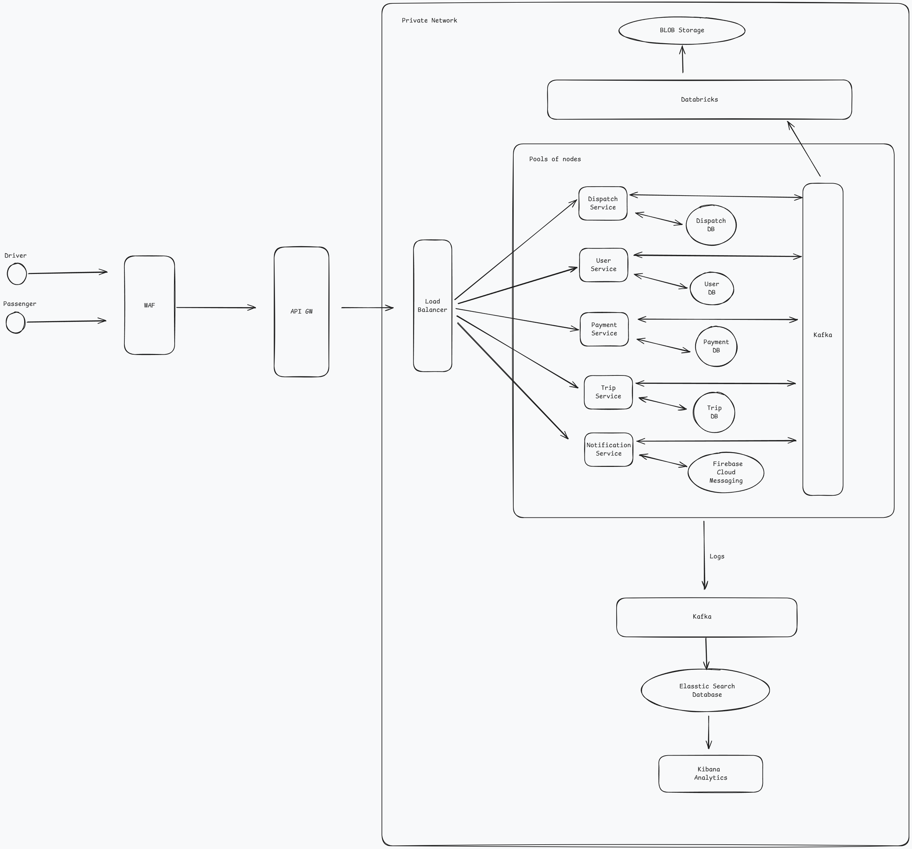

# System Design Architecture

  

Choosing the architecture of an application is one of the most important decisions that needs to be taken, not only for the development of the application but for the mainteinance and expansion that will have.

  
For this use case, where it is mentioned that the development will be a microservice we will build the system using the following architectures:

###  Event-Driven Architecture: 
A pattern that uses events to trigger and communicate between decoupled services in an asynchronous way
#### Pros:
- Scalable
- Real-time processing
#### Cons:
- Complexity
- Asynchronous Challenges
- Data Consistency

## Microservices

Each of the different microservices will be following the next architecture:
### Clean Architecture: 
Pattern that focuses on keeping everything in distinct layers where all  the dependency injections always point inwards emphasizing in the independence of frameworks.
#### Pros:
- Easy to mantain and scale
- Separation of concerns
- Loosely coupled
#### Cons:
- More layers, more code, more risk
- Dependency injection can lead to problems

The folder structure for all the microservices will be the following:
- **Services folder:** will have the HTTP routers and will interact directly with the controllers in the **Application folder**.
- **Application folder:** here we will have the controllers with the respective use cases.
- **Domain folder:** here the core entities will be defined.
- **Infrastructure folder:** where the interactions with the database, Kafka and external services will be done.

## Diagram Overview
